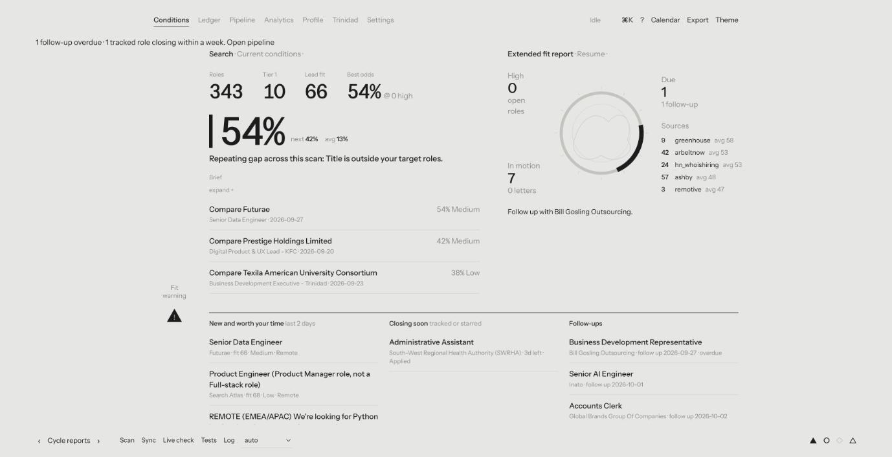
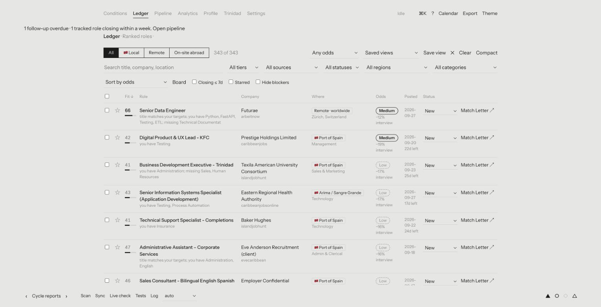
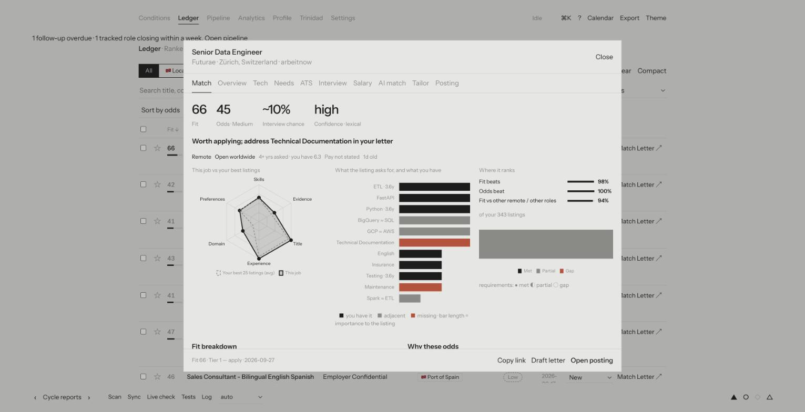
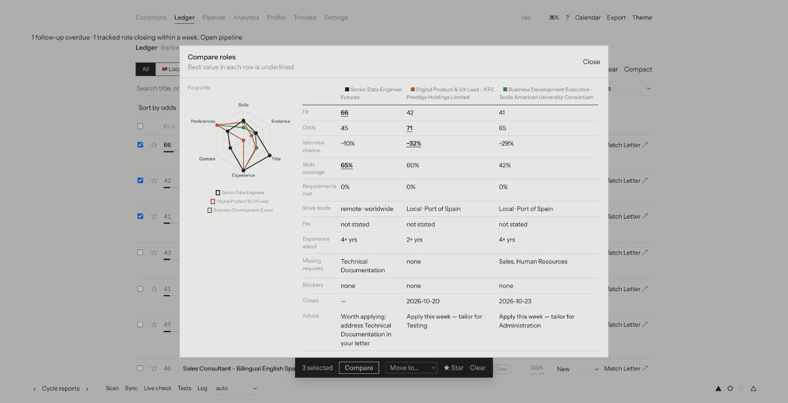
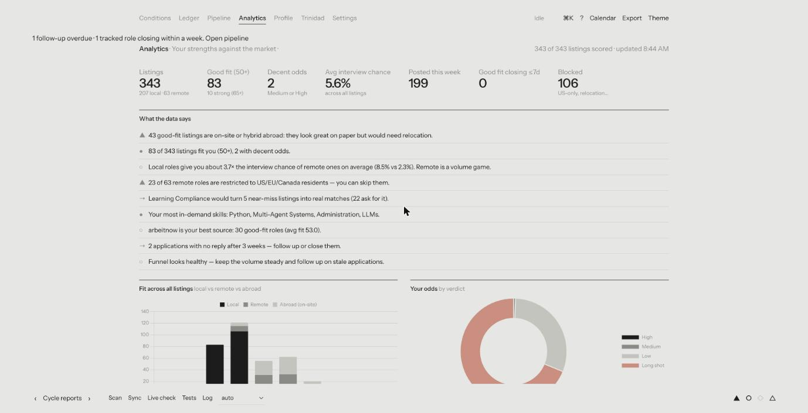
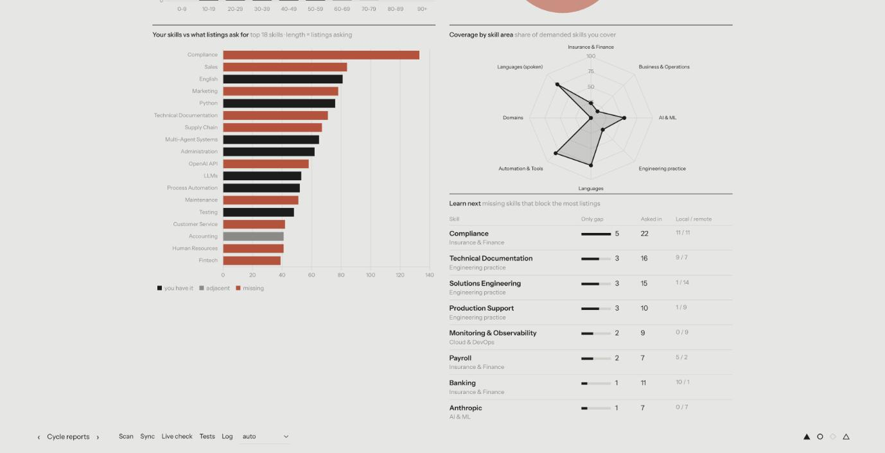
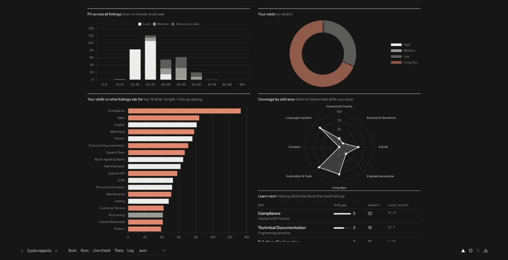
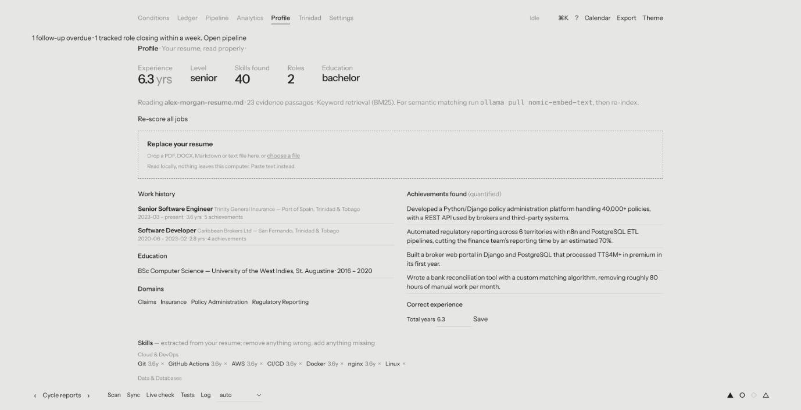
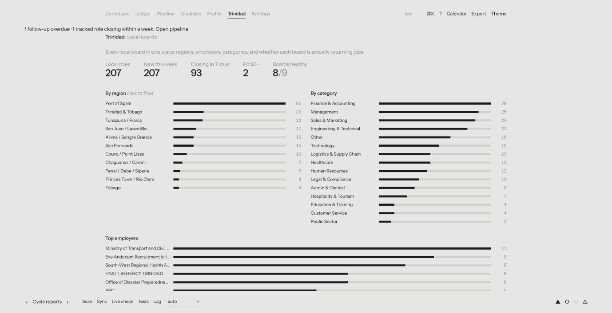
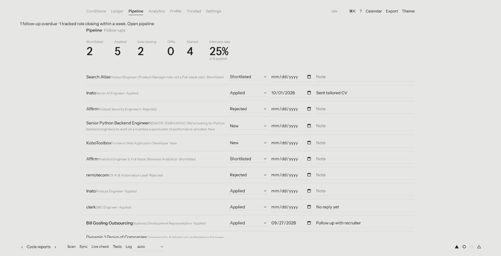

# JobHunter

**Local-first job search intelligence.** It scans job boards, reads your resume properly, and tells you which roles fit,
what your real odds are, and what to do next. Built for people looking in **Trinidad & Tobago and remotely**, and
useful anywhere.

[](https://github.com/surenjanath/jobhunter/actions/workflows/ci.yml)


Everything runs on your machine. Your resume, your job database and your notes never leave it (AI features that call
an outside provider are opt-in and say so). There is no account and no login.

```
 job boards ──► scanner ──► dedupe ──► resume-aware scoring ──► SQLite ──► Django web app
 (T&T + remote,  (parallel,    (best link   (fit, odds, evidence,      (jobs, resume,   (Conditions · Ledger ·
  ATS adapters)   polite)       wins)        remote eligibility)         history)         Pipeline · Analytics …)
```

## What it does

**Finds jobs everywhere you would look**
- **9 Trinidad & Tobago sources**: CaribbeanJobs, JobsTT, TrinidadJob, EmployTT (government), FindWorkTT,
  IslandJobHunt, Caribbean Jobs Online, Eve Anderson Recruitment, Digicel careers.
- **Any Trinidad employer, in two clicks**: paste a careers URL and JobHunter detects the applicant-tracking system
  (Greenhouse, Lever, Ashby, SmartRecruiters, Workable, Recruitee, Workday) and keeps only jobs located in T&T. No known
  ATS? It reads the page itself — the listing's own job links and titles — so a plain HTML careers page works too, with
  a preview before you save it. Sites that publish `schema.org/JobPosting` data get full quality (real dates, pay).
- **Remote boards**: Remotive, RemoteOK, Arbeitnow, Himalayas, Hacker News "Who is hiring", WeWorkRemotely, Jobicy,
  Working Nomads, Get on Board, plus company boards on Greenhouse / Lever / Ashby. Optional Jooble (API key).
- Stable ids (no duplicates between scans), expired postings dropped, region and category on every local job, per-board
  health tracking that flags a board that broke instead of silently returning nothing.

**Understands your resume (a small RAG pipeline, no dependencies)**
- Upload a PDF, DOCX, Markdown or text resume. It extracts roles (overlapping dates are not double-counted), years of
  experience, education and ~190 skills with **years of use**. You can correct anything it got wrong.
- The resume is split into evidence passages. For every requirement in a posting, JobHunter retrieves the passage
  that answers it (BM25, plus semantic embeddings automatically if you have an Ollama embedding model such as
  `nomic-embed-text`) and shows it next to the requirement.

**Scores honestly**
- **Fit** (0-100): skills, requirement evidence, title, experience, domain and your preferences.
- **Odds** and **interview chance**: a transparent log-odds model. It starts from a prior (local roles convert far better
  than remote ones), then adjusts for match quality, seniority gap, whether a remote role is actually open to you
  (US-only / EU-only roles are near-blockers), on-site abroad, freshness, pay versus your floor and blockers. Every
  factor is listed. Record application outcomes and the priors become **your own** observed rates.
- Local and remote are first-class: an All / Local / Remote / On-site-abroad switch, a work-mode preference
  (local-first, remote-only, …), TT$ and US$ salary floors, preferred regions.

**Optional accounts** — no login needed to try it
- Test your resume anonymously, then "Create a free account" and it comes with you — your resume, fit scores and
  pipeline become private to your email and password, accessible again on any device. Everyone still shares one
  scanned pool of listings; only your resume, scores and tracking are private. See [Accounts](docs/ACCOUNTS.md).

**Shows you the picture** (Chart.js, light and dark)
- **Analytics**: your skills against what listings ask for, coverage by skill area, "learn next" (missing skills that
  block the most listings, restricted to areas you already work in), local vs remote, who remote roles are open to, pay,
  closing calendar, application funnel with a bottleneck hint, scan history and board health. A **market intelligence** section adds a
  clickable fit-vs-odds opportunity map, a market-coverage score with a daily trend, skills that are asked for as a pair, employers
  worth watching, pay by category, the experience listings ask for, and how long roles stay open.
- **Per job**: radar of the job against your best listings, skills-vs-listing bars, requirement evidence, tailoring advice
  (bullets to lead with, honest wording, what *not* to claim), skill highlighting inside the posting, ATS check,
  interview prep built from the posting and your resume, salary versus your floor and similar listings.

**AI features** (every one works with built-in rules; a model, local or hosted, only *polishes* the result and only when you tick "Polish with AI")
- **Posting summary and red flags**: a plain-words TL;DR, must-haves, "wear many hats" / unpaid / stale / years-vs-level flags, good signs, and questions to ask them.
- **Bullet rewriter**: your best resume bullets for the posting, re-worded. A guardrail rejects any rewrite that adds a tool, number or claim your original did not contain.
- **Interview practice**: write an answer, get a score on STAR structure, numbers, specifics, "I" vs "we" and filler.
- **Outreach drafts**: follow-up, thank-you, recruiter message and referral ask, built from your best matching bullet.
- **Resume review**: weak openers, missing numbers, buzzwords, gaps, skills listed but never shown, with your own lines as examples.
- **Similar listings** and **Recommended for you** (learned from what you star and apply to), **plain-English search** in the command palette
  ("remote python roles worth applying", "finance jobs in Chaguanas closing soon") and **learning roadmaps** for each "learn next" skill.

**Helps you work the pipeline**
- Ledger with filters, saved views, multi-select **compare** (up to 4 roles) and bulk actions, keyboard shortcuts,
  command palette (⌘/Ctrl-K), employer drawer, status / follow-up / notes.
- Home "Today" block, follow-up and closing alerts, iCalendar export (`/api/calendar.ics`), daily digest
  (`python -m src.digest`), CSV export, cover-letter drafting (Claude Code CLI, Ollama, Anthropic API, or a template
  that needs nothing).

## Screenshots

The screenshots use a **fictional resume** ("Alex Morgan") and sample application history scored against real, publicly
listed jobs. Nothing here is anyone's personal data.

**Conditions**: where to spend today. Best odds, new roles worth your time, closing soon, follow-ups due.


**Ledger**: every role ranked by fit and odds, with a local / remote switch, saved views, compare and bulk actions.


**Match**: why a role scores the way it does. Radar against your best listings, what the posting asks for versus what
you have, where it ranks, then per-requirement resume evidence and every factor behind the odds.


**Compare** up to four roles side by side.


**Analytics**: plain-English findings, then charts on fit, odds, your skills against what listings ask for, coverage by
skill area and what to learn next. Light and dark themes.




**Profile**: your resume, read properly. Extracted roles, skills with years of use (editable), preferences and calibration.


**Trinidad**: the local market by region, category and employer, plus board health and one-click employer detection.


**Pipeline**: applications, follow-ups and your funnel.


## Quick start

Requires Python 3.12+. For PDF resumes install poppler (`brew install poppler` / `apt install poppler-utils`); DOCX,
Markdown and text work without it.

```bash
git clone https://github.com/surenjanath/jobhunter.git
cd jobhunter
./scripts/start.sh            # creates .venv, installs deps, migrates, serves http://127.0.0.1:8000
```

Or by hand:

```bash
python -m venv .venv && source .venv/bin/activate
pip install -r requirements.txt
cd django_project && python manage.py migrate && python manage.py runserver
```

Then:

1. Open **Profile** and upload your resume. Check the extracted skills, set your preferences (work mode, salary floor).
2. Press **Scan** in the dock (or `make scan`). The first scan takes a minute or two; the log streams live.
3. Open the **Ledger**, click any role, and read the **Match** tab.
4. Mark jobs Applied / Interviewing / Rejected on the **Pipeline**. Odds calibrate to your results over time.

On first run the `*.example` files in `jobhunt/config/` are copied to `profile.yaml`, `fact_bank.md`, `form_answers.md`
and `ui_settings.json`. Those copies are git-ignored: edit them freely, they stay local.

**Docker:** `docker compose up --build`, then open http://127.0.0.1:8000. Data lives in a named volume; the port is
bound to localhost only because the app has no login.

## Everyday commands

```bash
make run          # web app
make scan         # fetch, score, store (no Google Sheets write)
make rescore      # re-score stored jobs after changing your resume/preferences (no network)
make live         # audit every real job source over the network
make digest       # what's new and worth your time
make test         # all tests (offline)
```

Want scans to run on their own instead of clicking Scan in the UI? See [Scheduling scans](docs/SCHEDULING.md) —
`scripts/scan-cron.sh` plus a cron line or a macOS launchd example, lock-guarded so a slow run never overlaps itself.

## Pages

| URL | What it is |
|---|---|
| `/` | **Conditions**: best odds now, Today block (new roles, closing soon, follow-ups), daily brief |
| `/ledger/` | Ranked roles with filters, saved views, compare, bulk actions, kanban board |
| `/pipeline/` | Tracked applications, follow-up dates, notes, funnel figures |
| `/analytics/` | Charts and findings across all listings |
| `/profile/` | Resume upload, extracted profile and skills editor, preferences, calibration, versions |
| `/trinidad/` | Local market by region / category / employer, board health, add employers |
| `/settings/` | Sources on/off, thresholds, cover-letter provider |

Each page is its own Django template (`templates/pages/`) with its own script (`static/js/`); see
[docs/ARCHITECTURE.md](docs/ARCHITECTURE.md).

## Documentation

- [Architecture](docs/ARCHITECTURE.md): data flow, modules, scoring model, database
- [Configuration](docs/CONFIGURATION.md): `profile.yaml`, preferences, environment variables, AI providers
- [Job sources](docs/SOURCES.md): what is covered, how to add a site or an employer
- [API](docs/API.md): the JSON endpoints behind the UI
- [Scheduling scans](docs/SCHEDULING.md): cron / launchd, instead of clicking Scan in the UI
- [Accounts](docs/ACCOUNTS.md): what's private per account, what stays shared, and known gaps
- [Contributing](CONTRIBUTING.md)

## Testing

```bash
python jobhunt/tests/test_pipeline.py     # scanner, resume parsing, matching, sources: fixtures, no network
cd django_project && python manage.py test  # web app and API (uses a throwaway database)
```

Tests never touch your real database or config: the Django runner points the scanner at a temporary database, and the
scanner tests use their own.

## Privacy and responsible use

- **Local by default.** Data is stored in SQLite under `jobhunt/output/` (ignored by git). Nothing is uploaded.
- **AI is opt-in.** The AI features above, cover letters and resume enrichment use whichever provider you pin: local Ollama stays on your
  machine; the Claude Code CLI and Anthropic API send the text you give them to that provider.
- **Be polite to sites.** Fetchers are rate-limited, use public feeds / sitemaps / APIs where they exist, and only read
  pages that are publicly visible. LinkedIn and Indeed are deliberately **not** scraped (their terms forbid it); use their
  email alerts. Check a site's terms before adding it as a custom source.
- No login: run it on localhost. If you expose it, put it behind something that authenticates.

## Project layout

```
jobhunt/            the scanner and intelligence (plain Python package `src`)
  src/                sources, trinidad, ats_sources, resume_parse, retrieval, matching, calibration, db, …
  config/             *.example templates (your real config files are created from them, git-ignored)
  tests/              offline test suite
django_project/     the web app (Django + DRF)
  templates/          layout.html shell, partials/, pages/ (one template per page)
  static/js/          core.js (shared) + one script per page
  jobs/ candidate/ trinidad/ analytics/ core/   apps: API endpoints and pages
docs/               architecture, configuration, sources, API
scripts/start.sh    one-command setup and run
```

## License

MIT, see [LICENSE](LICENSE).
