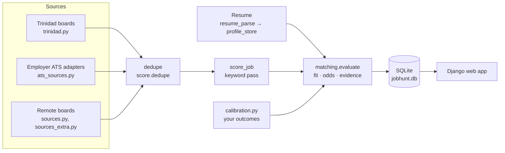

# Architecture

Two parts that share one SQLite database:

- **`jobhunt/`**: the scanner and all the intelligence, a plain Python package (`src`). It can run without the web app
  (`python -m src.run`, `python -m src.digest`).
- **`django_project/`**: the web app (Django + Django REST Framework). It reads and writes the scanner's database and
  calls into `src` for scoring, matching and parsing.

## The scan (`python -m src.run`)

1. `sources.fetch_all` runs every enabled source in parallel. Trinidad boards go through `trinidad.fetch_all_trinidad`,
   which records per-board health (`trinidad.HEALTH`); custom sites and employer ATS boards are included.
2. `score.rank` dedupes (the most trusted link wins, the others are kept in `alt_urls`), scores each job and filters.
3. `matching.apply_to_job` (when a resume exists) replaces the keyword-only picture with the profile-driven one.
4. `db.upsert_jobs` persists; health, a daily snapshot and expiry purging follow.

## Reading a resume (`resume_parse.py`, `profile_store.py`, `retrieval.py`)

Text extraction (PDF via `pdftotext`, DOCX via the standard library, MD/TXT) → sections → dated roles (overlapping ranges
merged, so years are not double counted) → skills from a shared taxonomy (`skills_taxonomy.py`) with years of use →
seniority, education, domains, quantified achievements. Your corrections are stored as *overrides* next to the parsed
profile, so re-uploading never destroys them. The resume is split into evidence passages (one per bullet) and indexed:
BM25 always, embeddings when an Ollama embedding model is installed.

## Matching (`matching.py`)

For one job it produces fit, odds, interview chance, per-requirement resume evidence, matched / adjacent / missing
skills, tailoring advice and the list of factors behind the odds.

- **Fit** = weighted blend of skill coverage (32%), requirement evidence (18%), title alignment (20%), experience (10%),
  domain (6%) and preferences (14%), blended 70/30 with the keyword score. Soft skills ("communication") are neutral,
  generic categories weigh less, and coverage is shrunk toward neutral when a posting names few skills.
- **Odds** are a log-odds model: `logit(prior) + Σ adjustments`, capped at 65%. Adjustments: qualification match,
  seniority gap, geographic access, freshness, preferences, domain edge, blockers, avoid-list. `likelihood` is the
  odds relative to a typical applicant of that kind (local vs remote reference), used for the High / Medium / Low /
  Long-shot verdict; `interview_chance` is the raw probability.
- **Geographic access** reads the posting: remote scope (`worldwide`, `americas`, `us_only`, `eu_only`, `canada_only`),
  contractor / EOR language, sponsorship, and on-site or hybrid work outside Trinidad & Tobago.
- **Calibration** (`calibration.py`): priors start at ~10% (local) and ~1.5% (remote) and move toward your own observed
  interview rate with Bayesian shrinkage as you record outcomes. Applications with no reply after 21 days count as misses.

This is a transparent heuristic model, not a trained classifier. It is only as calibrated as your recorded outcomes.

## AI features (`ai_features.py`, `django_project/ai/`)

Each feature is a deterministic function over your resume profile, the posting and your history, so it works offline. `use_llm=True`
adds one call through `llm.generate` and the result is validated: rewrites and drafts must not introduce numbers or skills absent from
the source text (`grounded()`), otherwise the rules output is kept and the UI says so. The Django app `ai` is a thin JSON layer; it
must be included before `jobs.urls` because `/api/jobs/<path>/…` is greedy.

**Voice** (`src/voice.py`): text-to-speech for the mock interview, via Kokoro — optional and lazily imported the
same way an LLM provider or the embedding model is; `interview_feedback()` always returns a `speech` field (plain
text, no dependency needed to build it), and `GET /api/ai/voice/speak/?text=...` turns any text into audio when
Kokoro is installed. Two backends, tried in order: `kokoro-onnx` (ONNX Runtime; model files fetched with
`python -m src.voice --download`) and the PyTorch `kokoro` package. Clips are cached on disk (least recently used
dropped past 400), voice names are whitelisted and the speed is clamped. Speech *input* (the candidate's spoken answer) is the browser's own Speech Recognition API —
no server component, no dependency, nothing sent anywhere for that half.

## Database (`jobhunt/output/jobhunt.db`)

`jobs` (scored listings incl. `match_json`), `app_status` (status, follow-up, notes, starred), `scans`, `source_runs`
(per-board health), `resume_versions` + `resume_chunks`, `cover_letters`, `snapshots` (daily market metrics). Schema and
in-place migrations live in `src/db.py`. The Django models for these tables are *unmanaged*; Django's own database
(`django_project/db.sqlite3`) only holds an audit log of status changes.

## The web app

- **Pages**: `config/urls.py` maps `/`, `/ledger/`, `/pipeline/`, `/analytics/`, `/profile/`, `/trinidad/`, `/settings/`
  to views in `core/views.py`. `templates/layout.html` is the shell (header, dock, dialogs, shared scripts);
  `templates/pages/*.html` each hold one page; `templates/partials/` holds shared fragments.
- **Scripts** (`static/js/`, plain scripts, no build step): `core.js` (helpers, state, scan runner), `boot.js`, `ui.js`,
  `job.js` + `match.js` (job dialog), `charts.js`, and one file per page. A page script registers `PAGE_HOOKS`
  (`beforeLoad`, `init`, `refresh`, `key`) and `boot.js` runs them.
- **API apps**: `jobs` (jobs, status, filters, export, digest, calendar), `candidate` (resume, preferences, rescoring,
  deep matching), `trinidad` (local market, sources, employer detection), `analytics` (insights, brief), `ai` (summary, rewrite, practice, outreach, recommendations, resume review, ask, roadmap), `accounts` (register/login/logout,
  and the per-account resume/pipeline/fit-score models and overlay used by `jobs` and `candidate` — see
  [Accounts](ACCOUNTS.md)), `coach` (interview coach: voice baseline, stories, drills, real interviews and prep plans, inbox, weekly progress; logic in `jobhunt/src/coach.py`).

## Configuration files

Personal config is created from `jobhunt/config/*.example*` on first run (`src/localfiles.py`) and is git-ignored.
See [CONFIGURATION.md](CONFIGURATION.md).
